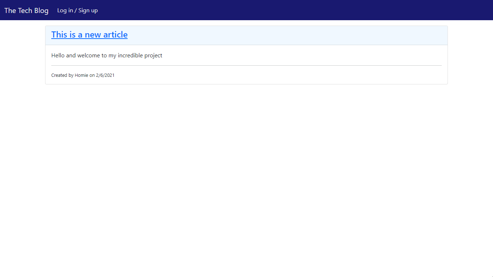
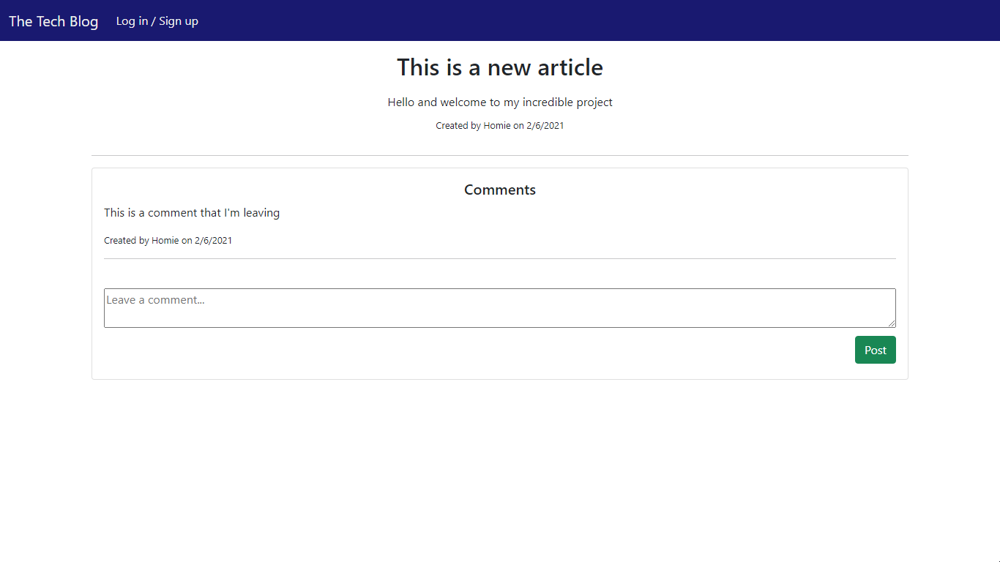
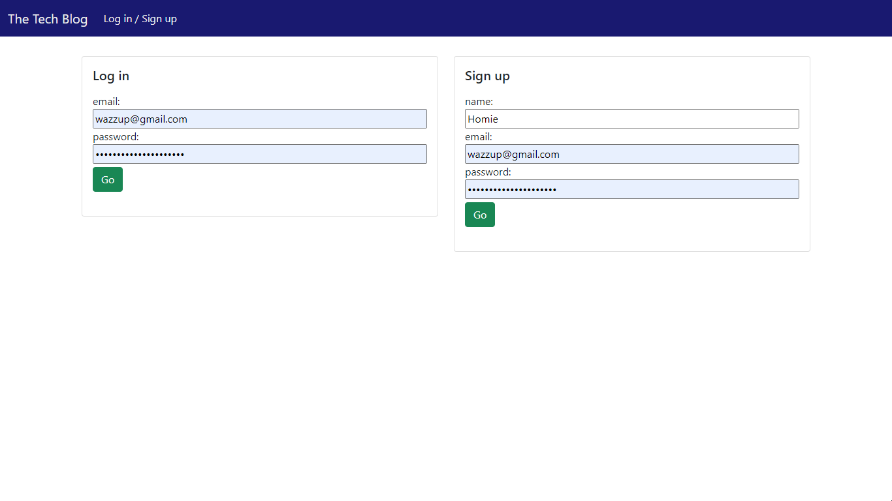

# Tech Blog

## Description

A blog to create and read articles on tech-related topics! 

## Table of Contents

<ul>
    <li><a href="#Installation">Installation</a></li>
<li>[Usage](#Usage)</li>
<li>[License](#License)</li>
<li>[Questions](#Questions)</li>
</ul>

## Installation

No installation required - run the app on [Heroku](https://mysterious-cove-59965.herokuapp.com/)

## Usage
<ol>
    <li>Open the app in Heroku</li>
    <li>Sign up for an account</li>
    <li>Head to the home page to read articles</li>
    <li>When you'd like to write an article:
        <ol>
        <li>Go to your profile</li>
        <li>Enter the article title and body</li>
        <li>Submit your work and check it out on the home page!</li>
        </ol>
    </li>
</ol>

## Screenshots

  

  

## License

This work is covered under [The MIT License](https://opensource.org/licenses/MIT)

## Questions

Please reach-out to me on [GitHub](http://www.github.com/jeffreytwoods2) or email me at: [jeffreytwoods2@icloud.com](mailto:jeffreytwoods2@icloud.com)

---
